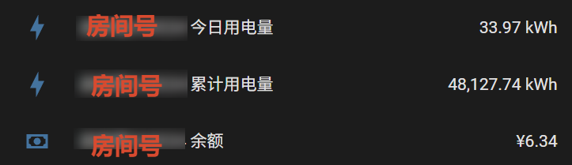
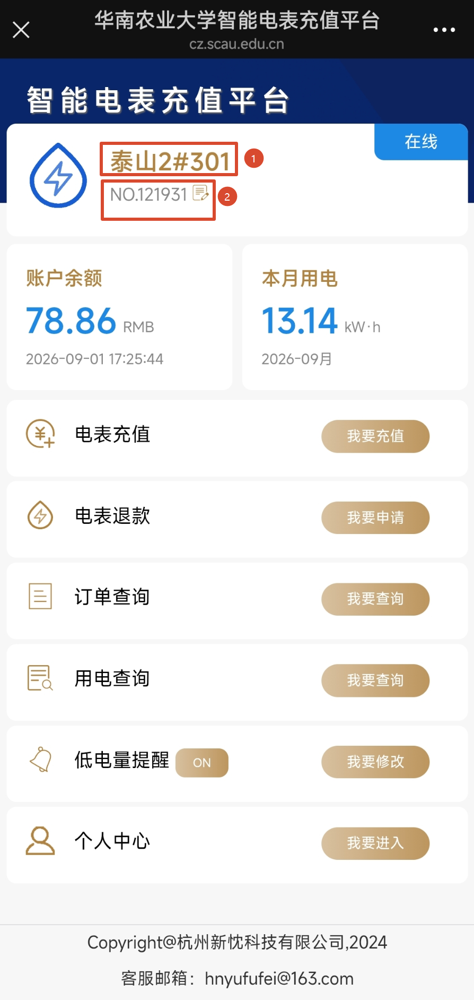

# SCAU Electricity for Home Assistant

[English](README.md) | [简体中文](README_zh-CN.md)

A Home Assistant custom integration that reads South China Agricultural University dormitory electricity meter data through the university's legacy API. It provides electricity usage and account balance readings, and estimates the daily electricity cost using the university rate of CNY 0.63/kWh.

## Features

Each configured room creates one device with four sensors:

- Today's energy usage (kWh)
- Today's electricity cost (CNY), calculated as `today's energy × CNY 0.63/kWh`
- Total energy usage since the meter was installed (kWh)
- Current account balance (CNY), with the balance refresh time and meter online status exposed as attributes

The polling interval is configurable during setup and defaults to 60 minutes. Failed polls can also be retried with configurable attempts and delay (defaults: 5 attempts and 10 seconds). Login tokens, timestamps, and request signatures are generated in memory; no account credentials or cookies need to be stored in Home Assistant.

> The university service is only available over HTTP. Room information is sent to `http://cz.scau.edu.cn` to retrieve the meter data.

## Installation

### Manual installation

1. Locate the Home Assistant configuration directory containing `configuration.yaml` (usually `/config`).
2. Copy the complete `custom_components/scau_electricity` directory from this repository to `/config/custom_components/scau_electricity`.
3. Fully restart Home Assistant. Reloading YAML alone does not load a new Python integration.
4. Open **Settings → Devices & services → Add integration** and search for **SCAU Electricity** or **华南农业大学电费**.
5. Enter the room name, room ID, polling interval in minutes (default: 60), retry attempts (default: 5), and retry delay in seconds (default: 10). The room fields correspond to the two highlighted values below:

   - Room name: `泰山2#301`
   - Room ID: `121931`

The integration validates the room by connecting to the service when the form is submitted. If validation fails, confirm that the Home Assistant host can access `http://cz.scau.edu.cn` and inspect logs from `custom_components.scau_electricity`.

### Updating and uninstalling

For a manual update, replace `/config/custom_components/scau_electricity` with the new version and restart Home Assistant. To uninstall, remove the integration entry under **Devices & services**, delete the component directory, and restart Home Assistant.

### HACS

This integration is not yet listed in the default HACS repository.

## MCP server

This repository also contains an independent stdio MCP server for reading the
same meter data. See the [MCP setup guide](mcp/README.md) for uv installation,
client configuration, available tools, and the planned `uvx` entry point.

## License

This project is licensed under the [MIT License](LICENSE).
